<div align="center">


# Reelhouse

**A warm, film‑house‑themed streaming front end — discover films and series, build a watchlist, and pick up exactly where you left off.**

[](https://nextjs.org)
[](https://react.dev)
[](https://www.typescriptlang.org)
[](https://supabase.com)
[](https://tailwindcss.com)

**[▶ Live site](https://reelhouse.d14f2cs6k7jhfn.amplifyapp.com)** · **[Repository](https://github.com/thedutchman33/ReelHouse)** · **[Docs](docs/)**

</div>

<br />


<br />

> Every screenshot on this page is a real capture of this application, taken from a production build in its
> zero‑configuration offline mode. That means the posters are Reelhouse's own generated placeholder artwork and
> the titles are invented — no third‑party studio art appears anywhere in this repository.

---

## 🎬 Product showcase

<table>
<tr>
<td width="50%" valign="top">

**Browse & filter**

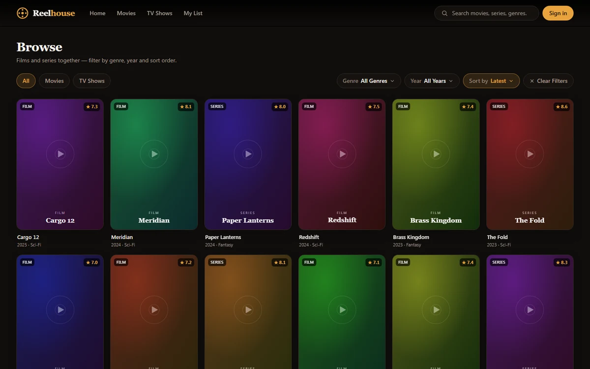

Type, genre, year and sort — every option maps to data the metadata layer can actually serve.

</td>
<td width="50%" valign="top">

**Search**

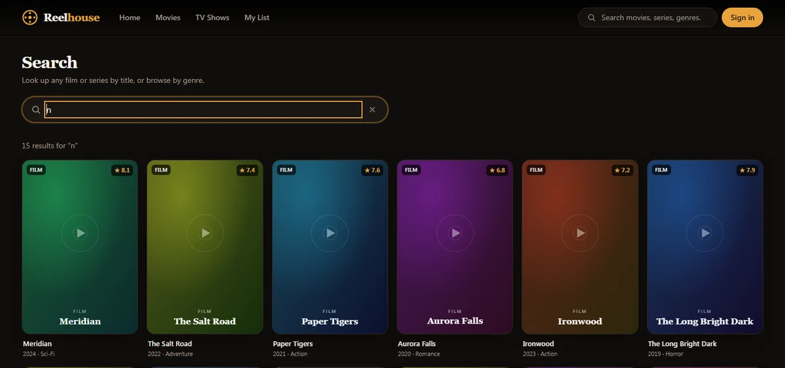

Debounced, server‑backed search with genre suggestion chips.

</td>
</tr>
<tr>
<td width="50%" valign="top">

**Film detail**

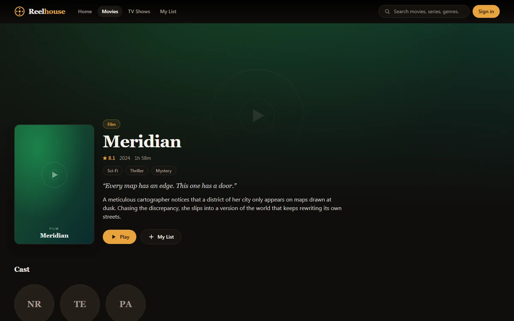

Backdrop hero, cast, and “More Like This”.

</td>
<td width="50%" valign="top">

**Series detail**

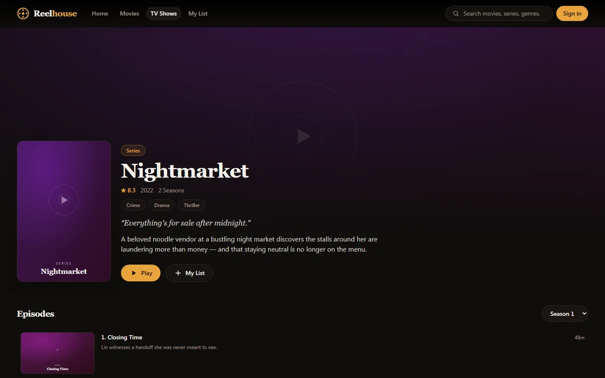

Season selector and episode list with per‑episode progress.

</td>
</tr>
<tr>
<td width="50%" valign="top">

**My List**

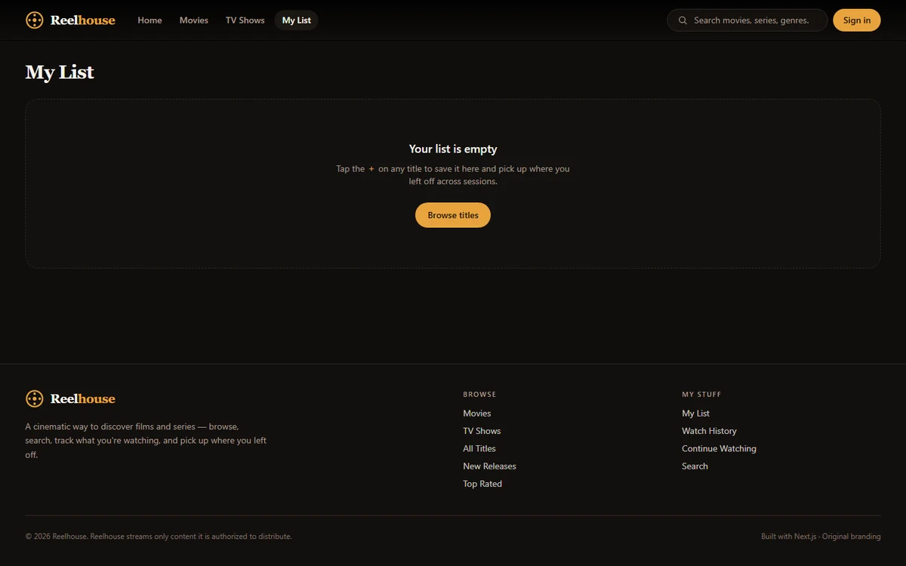

Watchlist, history and continue‑watching in one place.

</td>
<td width="50%" valign="top">

**Accounts**

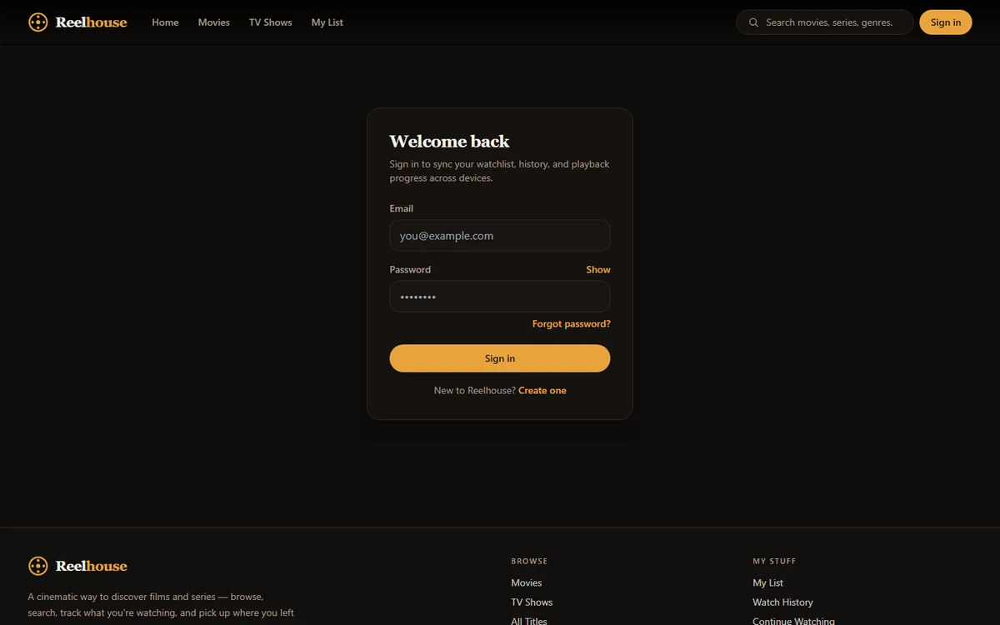

Supabase email/password sign‑in, sign‑up and password recovery.

</td>
</tr>
</table>

**The watch experience**

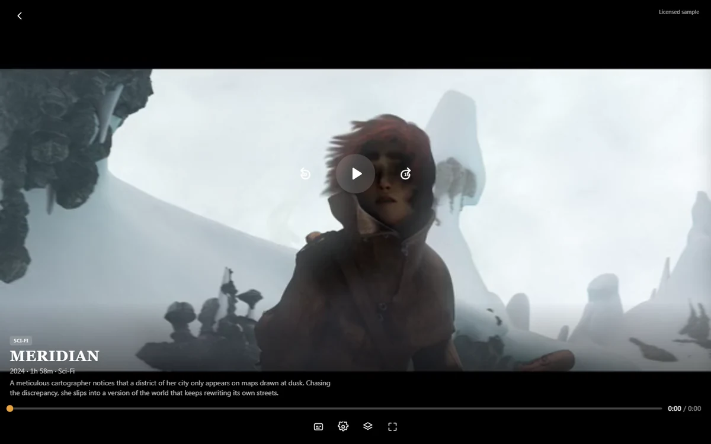

With no video provider connected, the watch page plays the freely‑licensed sample clips bundled in the repo —
each one clearly labelled **“Licensed sample”**. Playback position, subtitles and history all work against it.

---

## ✨ Guided tour

<div align="center">

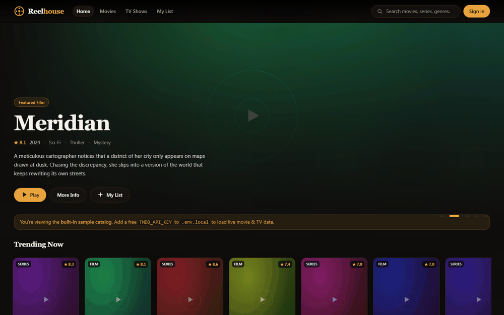

*A stitched tour of the real captured screens above — not a live screen recording.*

</div>

---

## 🍿 What is Reelhouse?

Reelhouse is a **streaming discovery and playback** web app: the surrounding product experience of a modern
streaming service — hero, rails, browse, search, detail pages, a personal library, accounts, and a watch page —
built as a complete, deployed application rather than a component demo.

**The problem it solves for a developer reading this repo:** streaming front ends are usually either a static
UI mock with no data layer, or a working app that can't be run without provisioning a database and half a dozen
API keys first. Reelhouse refuses that trade‑off. `npm install && npm run dev` gives you the *entire* product —
including video playback — with **no `.env` file, no API key, and no database**. Every external integration is
additive: supply a credential and that layer lights up; leave it out and the app degrades cleanly instead of
breaking.

What makes the implementation interesting:

- **Graceful degradation is a first‑class design constraint, not an afterthought.** Metadata falls back from TMDB
  to a bundled catalog, the library falls back from Postgres to `localStorage`, playback falls back from provider
  slots to a same‑origin sample surface, and the request proxy becomes a passthrough. Each fallback is covered by
  tests.
- **A provider architecture with nothing plugged into it.** Five video‑provider slots ship completely empty and an
  unconfigured slot is never listed, so the UI can't advertise a source that doesn't exist.
- **Security decisions are documented with their honest scope**, including where a control is defence in depth
  rather than the actual boundary.

> Reelhouse is original branding. It is **not** affiliated with, and does not use the name or assets of, any
> existing streaming site. All catalog titles, artwork and copy in offline mode are invented.

---

## 🚀 Features

#### 🎥 Discovery

- **Home** — auto‑rotating hero, a “Continue Watching” rail, and curated rows (trending, a ranked Top 10, new releases, genre rows).
- **Browse** — `/browse`, `/movies` and `/tv-shows` share one filter bar: content type, genre, year, and four sort orders. Filter state lives in the URL, so any view is linkable.
- **Search** — debounced and server‑backed at `/search`, with genre suggestion chips.
- **Detail pages** — backdrop hero, cast and “More Like This” for films; season selector and episode list with per‑episode progress for series.

#### ▶️ Playback

- **Watch page** — `/watch/[type]/[id]`, reading `?t` / `?s` / `?e` for position, season and episode.
- **Resume where you left off** — position is saved and restored per film *and* per episode, with an “up next” prompt for series.
- **Subtitles** — search OpenSubtitles from inside the player; the chosen file is fetched **server‑side**, converted to WebVTT, and loaded into the track. Font size, blur and colour are adjustable, and preferences persist.
- **Playback speed** — real `playbackRate` control.
- **Bundled sample clips** — Creative Commons open‑movie clips served same‑origin from `public/media/`, so playback works with no network at all.

#### 👤 Library & accounts

- **Watchlist, history and continue‑watching** — one storage‑agnostic store behind a single API.
- **Signed out:** everything persists to `localStorage` and stays in sync across browser tabs.
- **Signed in:** the same store becomes a fast local mirror of Supabase Postgres, with a **one‑time migration** that merges anonymous local data into the account on first sign‑in and a last‑write‑wins reconcile afterwards. Writes are best‑effort — offline changes reconcile on the next hydrate.
- **Owner‑tagged local state** — the mirror records which account it belongs to, so one user's leftover data can never be pushed into another user's account on a shared browser.
- **Auth** — email/password sign‑up and sign‑in, plus a full password‑recovery flow (request → emailed link → set a new password), all on Supabase's own session mechanism with no custom token system.
- **Playback analytics** — append‑only playback events (`play` / `pause` / `seek` / `progress` / `ended`), row‑level‑security scoped to the account.

#### 🧩 Integrations, all optional

- **TMDB** — live metadata behind one env var; both v3 API keys and v4 read‑access tokens are detected automatically. Absent, the app serves a bundled catalog and says so in a banner, so it's never ambiguous which one you're looking at.
- **Supabase** — auth, profiles, watchlist, history and playback events, with RLS. Absent, the app runs signed‑out on `localStorage`.
- **OpenSubtitles** — subtitle search and download, credentials server‑side only.
- **Five video‑provider slots** — `VIDEO_PROVIDER_1_*` … `_5_*`, empty by default. See [`docs/video-provider-setup.md`](docs/video-provider-setup.md).

#### 🎨 Interface

- Warm film‑house palette driven by CSS custom properties, so Tailwind's opacity syntax works against a single source of truth.
- Deterministic SVG placeholder artwork generated for every title — the UI looks complete without downloading a single image.
- Responsive from a narrow phone viewport up to a wide desktop, with a collapsing nav, a filter drawer, and touch‑friendly rails.
- Accessible popover and roving‑focus behaviour shared by every menu in the app.

---

## 🛠 Tech stack

| Layer | Choice |
| --- | --- |
| **Framework** | Next.js **16.3.1** — App Router, Server Components, Turbopack |
| **UI** | React **19.2.8**, TypeScript **5.5.4** (strict) |
| **Styling** | Tailwind CSS **3.4.13** with CSS‑variable theme tokens |
| **Backend** | Supabase — Postgres, Auth, row‑level security (`@supabase/ssr` 0.12.4, `@supabase/supabase-js` 2.112.3) |
| **Metadata** | TMDB API, with a bundled offline catalog as the default |
| **Subtitles** | OpenSubtitles API, server‑side only |
| **Testing** | Vitest **3.2.7** — 196 tests across 14 files |
| **Runtime** | Node **20.9+** (required by Next.js 16) |
| **Hosting** | AWS Amplify (server‑side rendering / compute) |

No UI kit, no state‑management library, no ORM, no HTTP client — six runtime dependencies in total.

---

## 🏗 Architecture

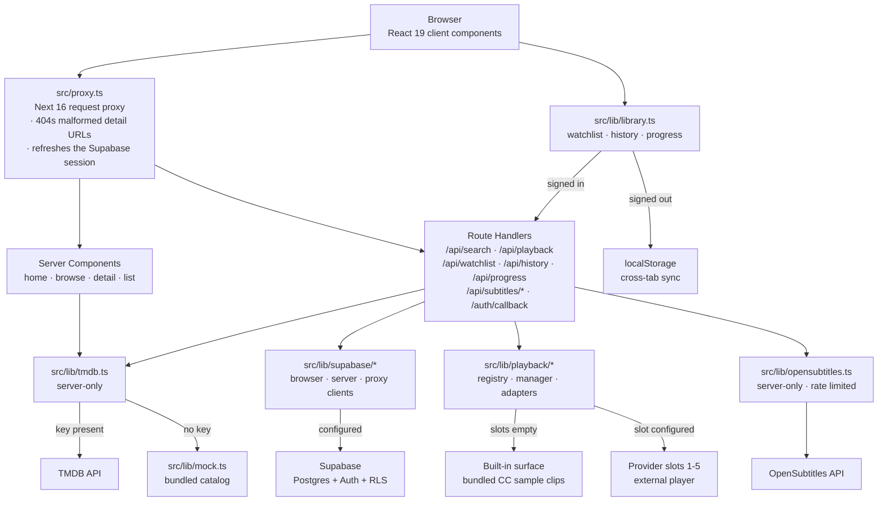

Two rules hold the shape together. **Secrets never cross the server boundary:** `tmdb.ts`, `providers.ts`,
`opensubtitles.ts`, `env.ts` and `config-summary.ts` are all marked `import "server-only"`, so the browser reaches
metadata and playback only through Route Handlers and Server Components. And **playback state is
provider‑independent:** watch history and progress are owned by the library store, not by whatever is rendering
the video, so switching source never resets a title, season, episode or saved position.

---

## 🔒 Security

The auth surface was audited and hardened, with each control's real scope written down rather than overstated.

| Area | What's in place |
| --- | --- |
| **Password recovery gating** | `/reset-password` unlocks only on a marker cookie set by `/auth/callback` *after* a one‑time emailed credential has actually been redeemed — not on the mere presence of a session. HttpOnly, `SameSite=Lax`, scoped to that one path, 15‑minute lifetime. Documented as defence in depth for the same‑browser case, **not** as the boundary. |
| **Server‑side password requirement** | The real boundary is enabled on the Supabase project: a password change from an ordinary session requires the current password, while genuine recovery sessions are exempt. Verified end‑to‑end against the live project with a real inbox. |
| **Session revocation** | Changing a password evicts every *other* session and keeps the acting device. Confirmed empirically — two independent sessions, password changed on one, the other's refresh token then rejected — rather than assumed from documentation. |
| **No account enumeration** | Sign‑in and sign‑up collapse every account‑related failure onto one neutral message, deliberately without inspecting the error to tell “wrong password”, “unconfirmed”, and “already registered” apart. Transport and rate‑limit failures are mapped separately so the UI never blames a password for a network outage. |
| **No open redirect** | `next=` targets are sanitised to same‑origin relative paths: absolute URLs, protocol‑relative `//`, the `/\` variant and control characters all fall back to `/`. |
| **Security headers** | Six enforced response headers on every route — `Strict-Transport-Security` (2 years, subdomains), `X-Content-Type-Options`, `Referrer-Policy`, `X-Frame-Options`, `X-DNS-Prefetch-Control`, `Permissions-Policy` (camera, microphone, geolocation and browsing‑topics all denied) — plus a **report‑only** Content Security Policy, which observes violations without yet enforcing them. |
| **Rate limiting** | The unauthenticated subtitle endpoints spend a server‑side credential, so they're limited per caller and keyed on the last `X‑Forwarded‑For` hop — the one a client can't forge behind the CDN. `Retry-After` is never zero, the key table is capped so a caller rotating identities can't turn the limiter into the leak, and it fails open rather than locking real visitors out. |
| **Row‑level security** | Every library, history and playback‑event row is scoped to its owner in Postgres. The only browser‑exposed Supabase values are the project URL and anon key, which are safe under RLS. |
| **Secret hygiene** | Credentials live in `.env.local` (git‑ignored) and are never logged. A dedicated test suite guards the server‑only module boundary. |
| **Dependency currency** | Runtime dependencies sit on current majors, with `postcss` pinned through `overrides` (including Next's bundled copy) to a version that clears its advisories. Run `npm audit` after any dependency change and prefer targeted patches — `npm audit fix --force` can pull in unintended majors. |

No system is “secure” in the absolute; these are the specific, verified controls this project ships, and the
remaining hardening backlog is tracked openly in [`PROGRESS.md`](PROGRESS.md).

---

## ⚡ Quick start

```bash
npm install
npm run dev
```

Open **http://localhost:3000**.

That's genuinely it — no `.env` file, no API key, no database. The app boots against the bundled catalog and works
**fully offline**, video playback included, because the sample clips ship in the repo and are served from the app's
own origin.

<details>
<summary><strong>Turning on the optional integrations</strong></summary>

<br />

```bash
cp .env.local.example .env.local
```

```dotenv
# Live metadata — v3 API key or v4 read-access token, detected automatically
TMDB_API_KEY=

# Accounts, watchlist sync and playback history
NEXT_PUBLIC_SUPABASE_URL=
NEXT_PUBLIC_SUPABASE_ANON_KEY=

# Subtitle search (server-side only)
OPENSUBTITLES_API_KEY=
# ...plus these two to also *download* a selected subtitle
OPENSUBTITLES_USERNAME=
OPENSUBTITLES_PASSWORD=
```

Restart the dev server after editing. Each block is independent: add only what you need, and the rest of the app
keeps working exactly as before. Apply `supabase/migrations/0001_init.sql` to your Supabase project to create the
schema and RLS policies. Behind a proxy or CDN, also set `SITE_URL` to the public origin — see
[`docs/deployment.md`](docs/deployment.md).

For video providers, see [`docs/video-provider-setup.md`](docs/video-provider-setup.md) — five slots are ready and
empty, and filling one in is an operator decision that requires a provider you are authorised to embed.

</details>

---

## 🧑‍💻 Development

| Command | What it does |
| --- | --- |
| `npm run dev` | Dev server with hot reload on port 3000. |
| `npm run build` | Production build. |
| `npm run start` | Serve the production build (run `build` first). |
| `npm run typecheck` | `tsc --noEmit` — full TypeScript check. |
| `npm test` | Run the Vitest suite once. |
| `npm run test:watch` | Vitest in watch mode. |

**Tests.** 196 tests across 14 files, covering the auth and recovery helpers, the browse filter model, the library
store and its history/progress reconcile, the playback manager's priority and fallback rules, the subtitle
integration, the rate limiter, env/config validation, the security headers, the server‑only boundary, and the
player's history writes. The provider architecture is exercised through mock providers, so slot registration,
priority, enable/disable, manual switching, controlled fallback, and loading/error states are all verifiable with
no real provider connected.

**Further reading** — [`PROGRESS.md`](PROGRESS.md) (the project's source of truth) ·
[`docs/video-provider-setup.md`](docs/video-provider-setup.md) · [`docs/deployment.md`](docs/deployment.md) ·
[`docs/phase-2.md`](docs/phase-2.md) · [`docs/phase-3.md`](docs/phase-3.md)

---

## 📁 Project structure

```
src/
  proxy.ts              Next 16 request proxy — session refresh + URL guards
  app/
    page.tsx            Home: hero, continue watching, curated rows
    browse/ movies/ tv-shows/    Shared filter bar, three entry points
    movie/[id]/ tv/[id]/         Detail pages (seasons + episodes for TV)
    watch/[type]/[id]/           Player page
    search/ my-list/             Search results, personal library
    login/ forgot-password/ reset-password/    Auth screens
    auth/callback/               Supabase email-link callback
    api/                         search · playback · watchlist · history
                                 progress · subtitles/{search,download}
  components/
    hero/ media/ browse/ detail/ search/       Discovery surfaces
    player/ playback/                          Player UI + provider chrome
    auth/ navigation/ brand/ common/           Shell, forms, primitives
  lib/
    tmdb.ts mock.ts             Metadata: live TMDB or bundled catalog
    library.ts                  Watchlist · history · progress store
    playback/                   Provider registry · manager · adapters
    providers.ts                Playback source abstraction (server-only)
    supabase/                   Separated browser · server · proxy clients
    opensubtitles.ts            Subtitle search + WebVTT conversion
    auth.ts rate-limit.ts       Auth helpers · request limiter
    env.ts config-summary.ts    Env validation + boot summary
    __tests__/                  Vitest suites
  types/                        Shared domain types
public/media/                   Bundled Creative Commons clips + subtitles
supabase/migrations/            Schema + RLS policies
docs/                           Deployment, phase notes, provider setup
```

---

## 📱 Responsive by design

<table>
<tr>
<td width="33%">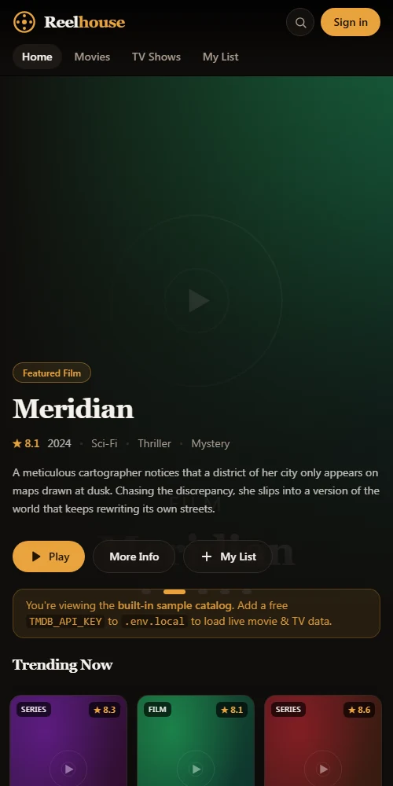</td>
<td width="33%">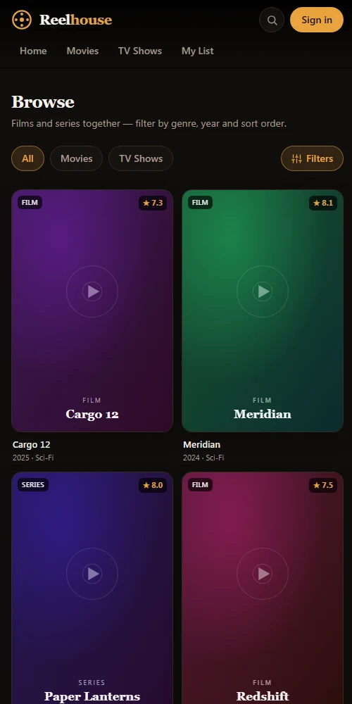</td>
<td width="33%">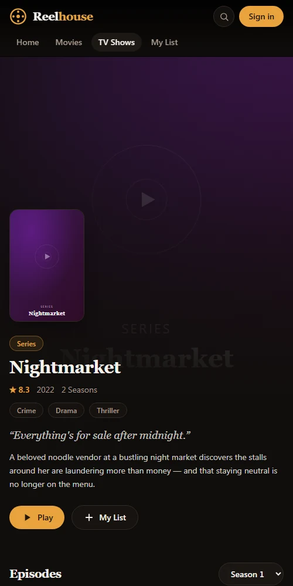</td>
</tr>
</table>

The same routes at a narrow viewport: the nav wraps to two rows, search collapses behind an icon, the filter bar
becomes a **Filters** button, and poster grids reflow. No separate mobile codebase, no device sniffing — one
responsive layout the whole way up.

---

## 📌 Project status

**Complete and deployed.** Reelhouse is a finished project, live at
**[reelhouse.d14f2cs6k7jhfn.amplifyapp.com](https://reelhouse.d14f2cs6k7jhfn.amplifyapp.com)** and closed as of
August 2026, with every gate green: clean `tsc --noEmit`, 196 passing tests, and a clean production build.

**Shipped and verified**

- Full front end — discovery, detail, search, library, player
- Live TMDB metadata, with offline fallback
- Supabase auth, profiles, watchlist, history, playback events, RLS isolation — validated end‑to‑end against a hosted project
- Password recovery, verified on production with a real inbox
- Subtitle search and download with resilient error handling
- Next.js 16 / React 19
- The auth security hardening described above
- Production build and deployment on AWS Amplify

**Intentionally deferred — by design, not left unfinished**

- **Real video providers.** The five slots stay empty until an authorised provider is supplied. The architecture, configuration surface, mock‑provider tests and setup guide are all already in place, so activation is configuration rather than a rebuild.
- **Optional polish** — dedicated profile/settings pages, and per‑route loading skeletons for live‑metadata latency (the `Skeleton` components exist and are ready to wire up).
- **Further optional hardening**, tracked in [`PROGRESS.md`](PROGRESS.md).

None of these are blockers; the application is production‑ready as it stands.

---

<div align="center">


**Reelhouse**

Built with Next.js 16 · React 19 · TypeScript · Tailwind CSS · Supabase · Vitest

**[reelhouse.d14f2cs6k7jhfn.amplifyapp.com](https://reelhouse.d14f2cs6k7jhfn.amplifyapp.com)**

<sub>Sample clips shown in the player screenshots are Blender Foundation open movies, used under CC‑BY.<br />
Metadata, when configured, is provided by TMDB; Reelhouse is not endorsed or certified by TMDB.</sub>

</div>
